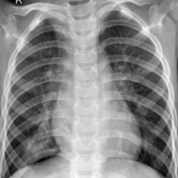
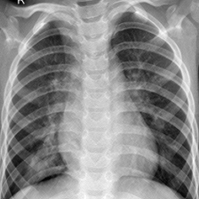

# Stealth- Crafting Black-Box Attacks on Medical Images through Singular Value Manipulation
Official repo for **Stealth**.

## 🚀 Key Features
- Stealth is a highly efficient black-box adversarial attack for medical image classification, marking the first approach to utilize singular value manipulation for attack generation.
- Stealth uniquely uses SVD alone and operates as a true black-box attack, requiring only predicted hard labels without depending on prediction probabilities.
- Stealth is tested on 4 different publicly available datasets across diverse classification settings and modalities (Chest X-Ray, Colonoscopy, MRI, and Mammogram).
## 🛠 Instructions to Run the Code
- For test case you can Download the Chest Radiography Dataset - https://www.kaggle.com/datasets/preetviradiya/covid19-radiography-dataset?select=COVID-19_Radiography_Dataset or you can use your own dataset and modify the rest of the code accordingly.
- In this paper, we have used the base models ResNet18, ResNet−34, ResNet-50, EfficientNet-B0 as backbone architectures for different datasets as explained in the paper. You are free to choose the model as per your convenience. Be sure to fine tune the model as required.
- Initially start with the PGD Attack Notebook and store the Singular values, both real and attacked. Replace the CNN.pth file with the corresponding trained base model.
- Use these Singular Values to train the MLP (inital attack) and save it as the MLP Model as MLP.pth
- Run the Stealth Attack Notebook. Make sure to modify the MLP.pth and CNN.pth accordingly.

## Sample Images

| Original Image | Stealth Image |
|---------------|---------|
|  |  |

## 📖 Citation
If you find this repository useful, please consider citing this paper!
